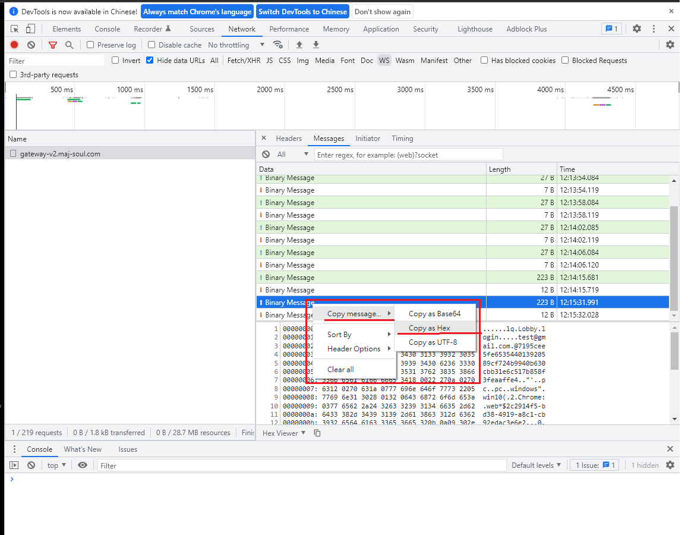
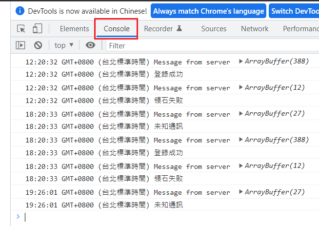

# 雀魂自動登入領月卡
## 專案緣起
雀魂月卡60鑽需每日登入領取，但不一定每日都會想打麻將，故提供自動領石的懶人自動化程式。

## 限制
需能用雀魂網頁版電郵帳號登錄成功
## 使用方法
1. 取得登入金鑰
	- 打開chrome，進入[雀魂網站](https://game.maj-soul.com/1/)
	- 按下F12開啟開發者模式，點選NetWork頁籤並篩選WS
	- 打帳號密碼進入遊戲並登錄成功
	- 開始找目標通訊
		- 
		- 左邊Name選擇gateway-v2.maj-soul.com，右邊頁籤選擇Messages會看到很多Binary Message
		- 找綠色向上箭頭，內容比較大前面有login與你的email的通訊
	- 複製hex
		- 
		- 對目錄通訊右鍵按複製，Copy message...->Copy as Hex
2. 修改網頁
	- 右鍵另存[網頁](https://raw.githubusercontent.com/lag945/majsoul_autoMonthTicket/main/majsoul_autoMonthTicket.htm)到桌面
	- 記事本開啟majsoul_autoMonthTicket.htm
	- 將上一步複製的hex貼上loginKey中，如下，開頭可能是02xx，0201~0209甚至更高都有可能
		```
		const loginKey = '0206******';
		```
	- 存檔網頁
3. 執行網頁
	- 點兩下執行網頁，可以在F12的Console頁籤看到領石成功即代表完成。
	- 而剛才登錄的網頁也會顯示重複登入被踢出。
	- 網頁會在6小時後自動重連領石。
	- 
## 原理
1. 雀魂網頁版使用WebSocket通訊，本網頁模擬了兩個通訊
	- 登入，需自行複製通訊內容
	- 領石，固定，只要登入成功即可領石

## 未來發展
1. 提供unsafe版本以降低使用門檻，使用者只需要填入自己的e-mail帳號即可(但密碼需為固定，有被盜風險)
2. 更豐富的領石時間設定
3. 輸出更詳細與準確的資訊

## 參考
1. [majsoul_wrapper](https://github.com/747929791/majsoul_wrapper)
